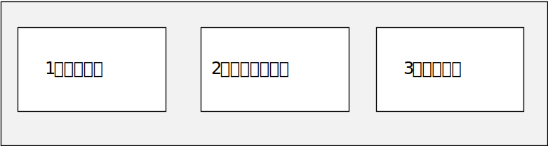
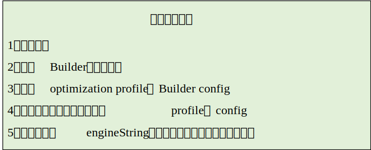
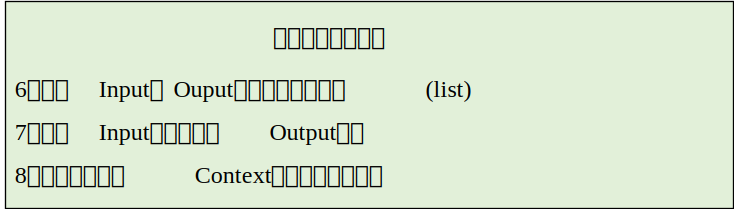
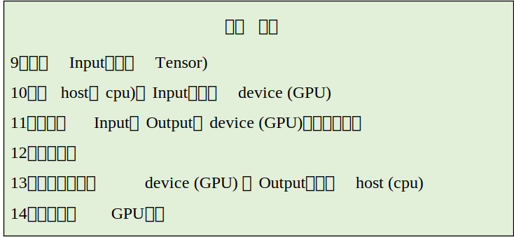

# TensorRT学习（1）——trt python api全流程

### 简短介绍
通过的[cookbook](github.com/NVIDIA/trt-samples-for-hackathon-cn/tree/master/cookbook)样例学习，弄明白了trt的整个流程，算粗略的入门了trt。代码已放入该文件夹里，myTrt.py是我自己照着main.py（来自于cookbook）逐行研究的代码。

**这个是python api例子，根据我个人的学习理解，我将trt推理周期划分了三个阶段。**

#### 网络创建

#### 创建执行环境

#### 运行阶段

